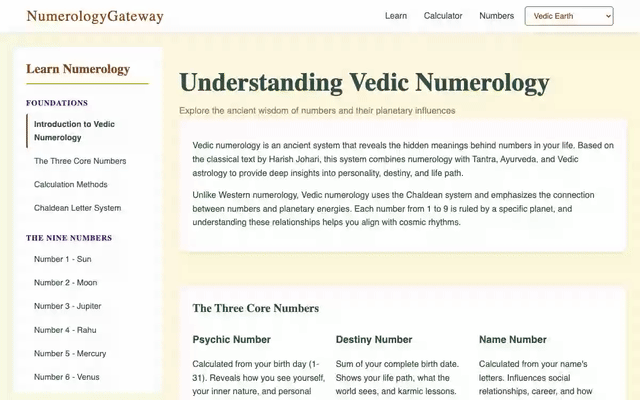
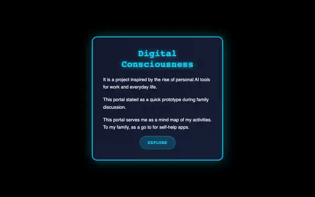

# Innovative Solutions

A collection of small, self-contained HTML/JavaScript apps by [Sameer Goel](https://sameerai.com), organized into six categories across two sides: **AI** and **Inner Intelligence**.

Each project lives in its own folder and can be opened directly by loading its `index.html`.

> **For AI agents**: read [`CATEGORIES.md`](CATEGORIES.md) for the taxonomy (where new projects go) and [`SOLUTIONS.md`](SOLUTIONS.md) for the portfolio map of projects hosted outside this repo. Together with this README, those three files are the source of truth for building a unified portfolio view.

## Gallery

Click any preview to open the live solution.

### 🤖 Autonomous-AI

#### SAaaS
Design your cloud solution in minutes, not weeks.

[](https://sameer-goel.github.io/innovative-solutions/Autonomous-AI/saaas/)

#### AI Hackathon Arena
Let 36 AI models solve your problem while you watch.

[](https://ai-pool.netlify.app/)

### 🎓 Learn-AI

#### AI Evolution Timeline
See where AI came from and where it's going, in one scroll.

[](https://sameer-goel.github.io/innovative-solutions/Learn-AI/ai-evolution-timeline/)

#### AI Career Explorer
Find the AI role that fits who you already are.

[](https://sameer-goel.github.io/innovative-solutions/Learn-AI/ai-career-explorer/)

#### Update Mind Space
Unlock the hidden superpower you already have: working with AI.

[](http://updatemind.space/)

#### Learn Creative Prompt Engineering
Stop rushing to answers. Start falling in love with questions.

[](https://sameer-goel.github.io/learn_creative_prompt_engineering/)

### 🧩 Misc

#### Crisis Support Program
When crisis hits, match the right helper to the right need in minutes.

[](https://sameer-goel.github.io/crisis-support-program/)

#### Life Experiences Dashboard
See how much life you have left. Spend it on what matters.

[](https://sameer-goel.github.io/life/)

#### Dvine Meet
Turn any gathering into a moment people remember.

[](https://sameer-goel.github.io/divinemeet/)

### 🧠 mind

#### Brain Gym
Reclaim the focus and attention that scrolling stole from you.

[](https://sameer-goel.github.io/innovative-solutions/mind/brain-gym/)

#### Total Recall
Remember the books that changed you, not just the ones you finished.

[](https://sameer-goel.github.io/innovative-solutions/mind/total-recall/)

#### Binaural Beats
Reach focus, calm, or deep sleep on demand.

[](https://sameer-goel.github.io/innovative-solutions/mind/binaural-beats/)

#### Solfeggio Frequency
Ancient healing frequencies, one tap away.

[](https://sameer-goel.github.io/innovative-solutions/mind/solfeggio-frequency/)

#### Meditation Game
Meditation you'll actually stick with.

[](https://sameer-goel.github.io/innovative-solutions/mind/meditation-game/)

### 💪 body

#### Breathing Circle
Twelve breaths to calm, focus, or energy. Pick one.

[](https://sameer-goel.github.io/breathing-circle/)

### 🕉️ soul

#### Ego Death Simulation
Dissolve the ego. Meet what's still there.

[](https://sameer-goel.github.io/innovative-solutions/soul/ego-death-simulation/)

#### Numerology Gateway
Discover the numbers that shape your life.

[](https://sameer-goel.github.io/numerology/)

### 🌟 Portals

#### Sameer AI Portal
Where artificial intelligence meets inner intelligence.

[](https://sameerai.com/)

#### Meet Sameer
The mind behind Sameer AI.

[](https://sameer-goel.github.io/meet/)

#### MyAppStore
Every app Sameer built, in one place.

[](https://sameer-goel.github.io/MyAppStore/)

## Categories

### 🤖 AI

| Folder | What's inside |
|---|---|
| [`Autonomous-AI/`](Autonomous-AI/) | Agentic systems where AI acts on its own |
| [`Learn-AI/`](Learn-AI/) | Educational and exploratory experiences about AI |
| [`Misc/`](Misc/) | Catch-all for AI-adjacent projects |

### 🪷 Inner Intelligence

| Folder | What's inside |
|---|---|
| [`mind/`](mind/) | Sound, frequency, and memory-focused apps |
| [`body/`](body/) | Physical wellness explorations |
| [`soul/`](soul/) | Spiritual and consciousness experiences |

## Relationship to `sameerai`

The portal site at [sameerai.com](https://sameerai.com) (source: [`sameer-goel/sameerai`](https://github.com/sameer-goel/sameerai)) is the landing page that links to each of these projects. This repo is where the actual apps live.

Projects that live outside this repo (Canva decks, Prezi presentations, other GitHub Pages sites) are linked from the `sameerai` portal but are not mirrored here. See `MAPPING.md` for the full source-to-destination table and the list of external-only projects.

## Repo layout

```
innovative-solutions/
├── README.md
├── PLAN.md
├── MAPPING.md
├── Autonomous-AI/
├── Learn-AI/
├── Misc/
├── mind/
├── body/
└── soul/
```

## How to run a project locally

Because these are pure static pages:

```bash
# from the repo root
python3 -m http.server 8000
# then browse to http://localhost:8000/mind/binaural-beats/
```

No build step, no dependencies to install.
